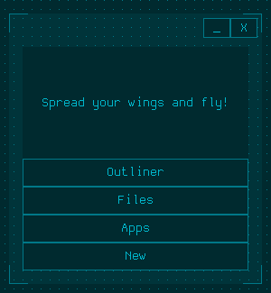
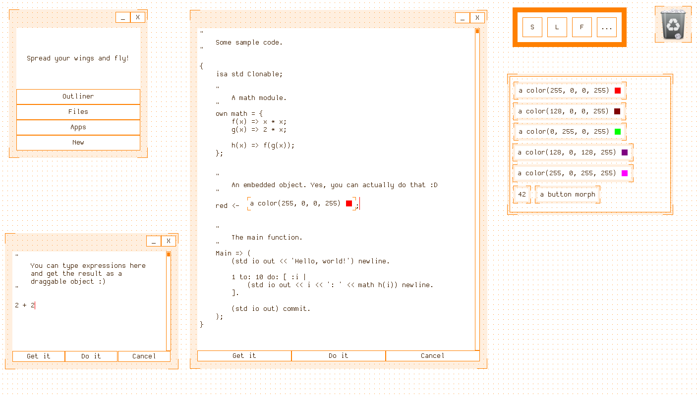
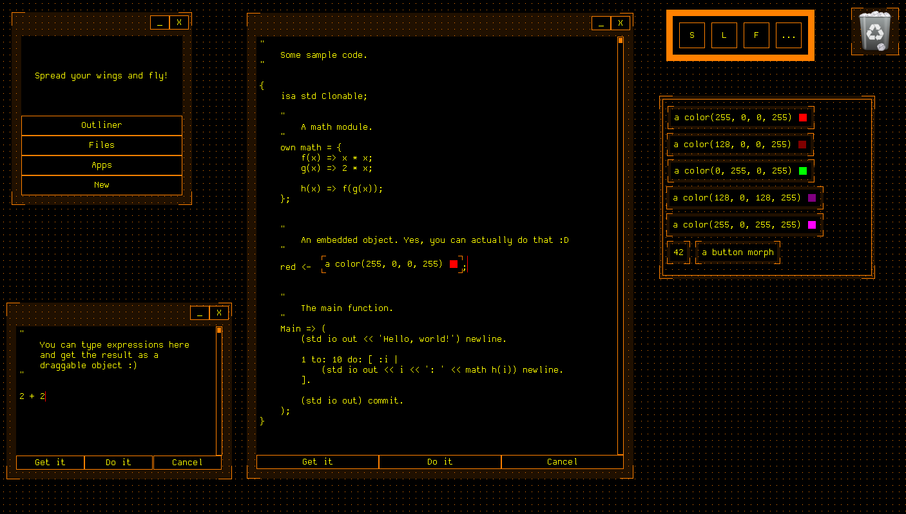
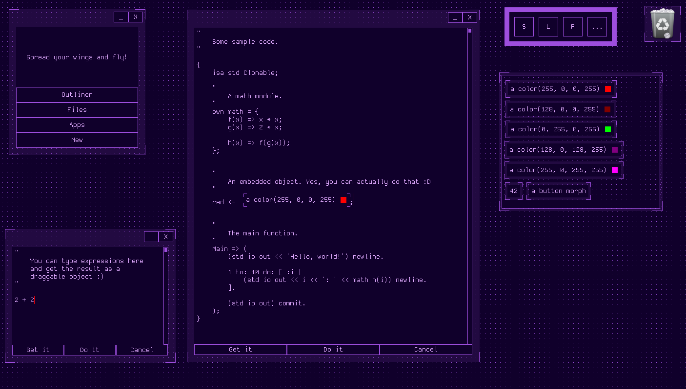
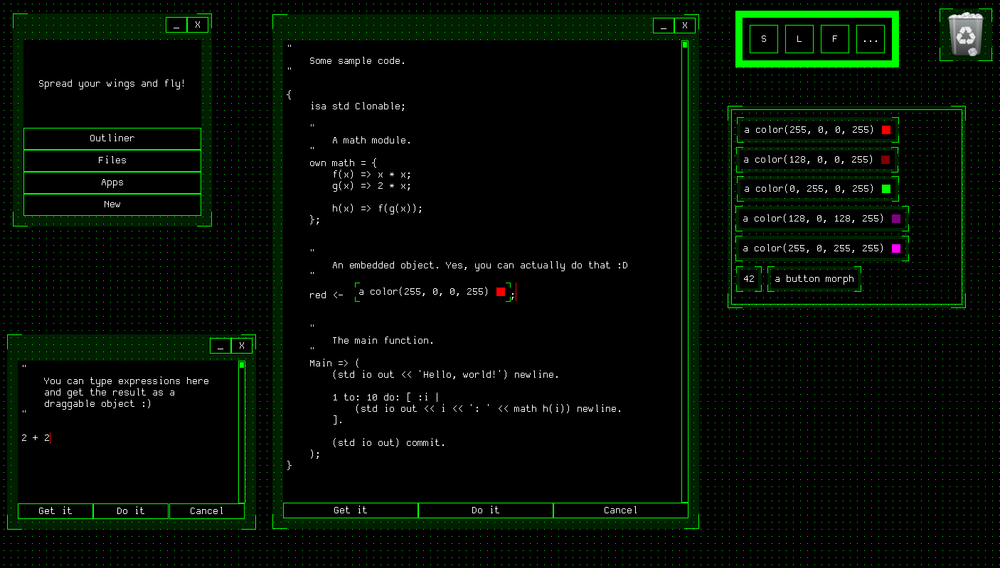
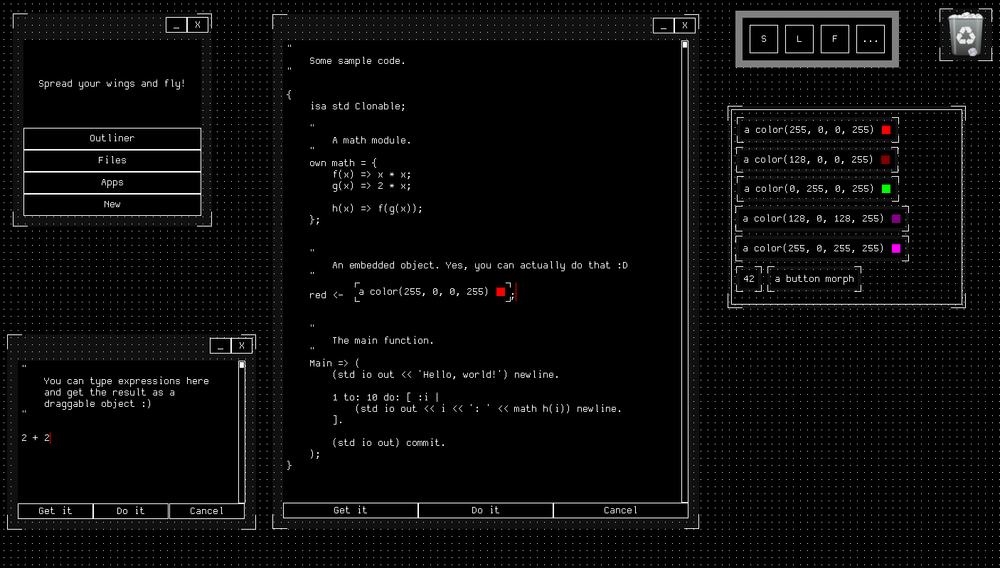

# EcoRE - The Ecosphere Runtime Environment


This is **EcoRE**, my little programming language playground that I've been working on in my spare time since 2020.

It acts as a virtual machine and runtime environment for my programming language **Eco**, which is a language inspired by [Self](https://selflanguage.org/).

I shared the inspiration for this project in [an E-Mail to the mailing list of the Self programming language](https://lists.selflanguage.org/archives/list/self-interest@lists.selflanguage.org/thread/NGRNRIPZZJTUDMFBRRYUXG56TEQJORG6/).

## Features and Scope

EcoRE is capable of executing a graphical programming environment for the Eco programming language, supporting:

 - A Morphic-like user interface
 - Image-based persistence
 - Automatic garbage collection
 - Interactive code editing
 - Decompilation of bytecodes
 - Draggable objects
 - Outliners and Reflection
 - Code reloading
 - Seamless FFI calls to various libraries

However, the system was designed for experimental purposes only, and will be superseded by improved VMs in the future.

Planned and partially implemented features are:

 - Extracting FFI information from DWARF debugging data
 - Python interop
 - Distributed objects and networking support
 - Multiple languages sharing the same object space (Eco, Smalltalk, Lisp)
 - Support for virtual reality and a 3D user interface
 - A presentation mechanism similar to McCLIM

## Building and Running EcoRE

If you are using Debian or Fedora, it should be enough to type

```sh
make install-deps
make run
```

while in the toplevel directory of the repository and the system will take care of the rest.

EcoRE depends on:
 - SDL2
   - SDL2
   - SDL2_ttf
   - SDL2_image
   - SDL2_gfx
 - zlib
 - libffi

In order to create the bootstrap image, you also need Python (version 3).

You might have to change a few things in order to get it to run on your machine.

Once the VM has started, you will be greeted by a black loading screen. The loading process takes about one minute, depending on your hardware. After that, the main menu will open:



You can now choose between
 - **Outliner** to examine and modify the current session object (for debugging purposes)
 - **Files** to load Eco files from the disk
 - **Apps** to try out various programs written in Eco
 - **New** to start a shell or an editor (a context menu will open)

To close the session, press `Shift+Esc`.

# Screenshots and Impressions

## Loading Screen


## User Interface


## Themes











